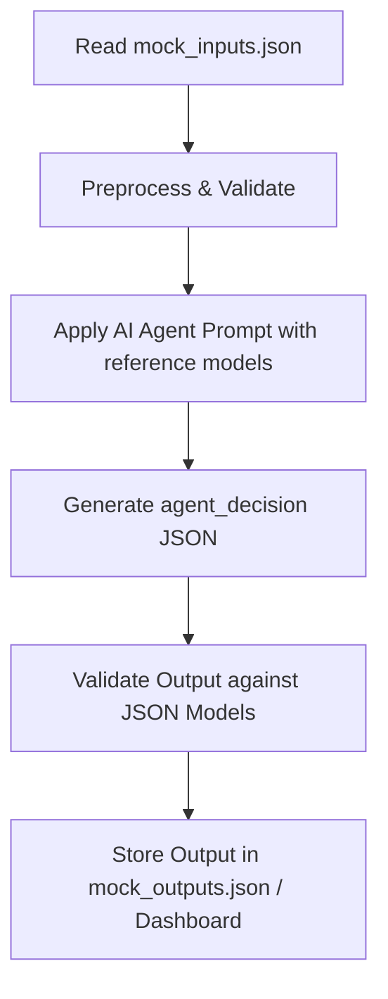

# High-Level Design (HLD) for Sentiment-Based Escalation AI Agent

## Objective

Automate the triage of store notifications, classify sentiment and severity, decide if human intervention is required, and trigger appropriate actions.

## Simplified Pipeline

1. **Read Inputs**

   * Load `mock_inputs.json`.
   * Each input contains: store, shipment, sales_context, message_text.

2. **Preprocess Inputs**

   * Validate required fields (store_id, shipment_id, message_text).
   * Flag missing or error-prone data.

3. **Apply Agent Prompt**

   * Send structured input to AI Agent along with reference models:

     * `sentiment_model.json`
     * `severity_model.json`
     * `priority_model.json`
     * `actions_model.json`
   * Prompt rules:

     * Map message_text → sentiment
     * Determine severity based on shipment + sales season
     * Assign priority
     * Decide HITL
     * Pick action

4. **Generate Output**

   * Produce standardized `agent_decision` JSON referencing IDs and labels from models.

5. **Validate Output**

   * Ensure all output IDs and labels exist in the corresponding JSON models.
   * Check confidence value, HITL consistency.

6. **Store Output**

   * Save to `mock_outputs.json` or production system.
   * Log for auditing and future learning.

## Visual Flow

## Key Notes

* AI Agent is invoked only in the "Apply Agent Prompt" step.
* Models provide deterministic labels: sentiment, severity, priority, actions.
* HITL is triggered based on confidence and severity.
* Fully auditable and extendable pipeline for multiple stores or notifications.
